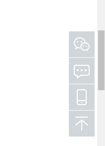
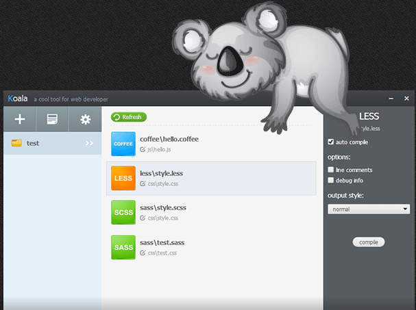
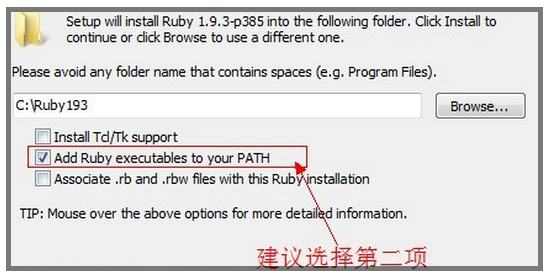
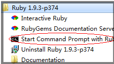
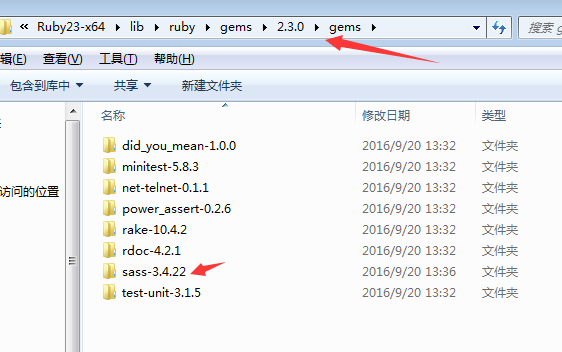
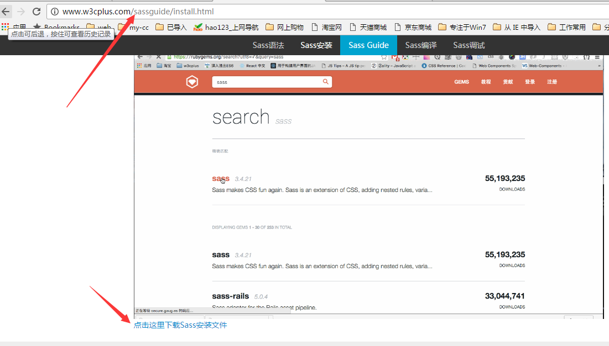
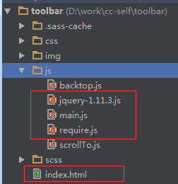

# sass+require实现侧边栏

## 一、效果图（如下）及使用的技术



>  实现用sass实现页面中右侧固定侧边栏的样式，用require.js实现返回顶部的功能

## 二、sass

  具体的sass的介绍就不多说了，大家可以参考sass官网介绍，下面说一下sass的两种编译方法；

> a、koala编译

  koala 是一款桌面程序，支持 less 、 sass 、 coffeescript 即时编译。下载地址：http://koala-app.com/

  

  koala可以直接对scss进行编译，不需要敲命令，并且可以对scss进行监控，具体使用方法见：http://www.w3cplus.com/preprocessor/sass-gui-tool-koala.html

  ***注：此种编译方法比较方便，只要下载koalo即可，新建*.scss文件，拖进工作区点击”完成“，即可，并且可以监控添加到工作区的文件，不用每次点击编译;***

> b、sass命令编译（推荐）

  此方法需要进行以下步骤：
>（1）因为sass依赖于ruby环境，所以装sass之前先确认装了ruby。官网下载：ruby；
        在安装的时候，请勾选Add Ruby executables to your PATH这个选项，添加环境变量，不然以后使用编译软件的时候会提示找不到ruby环境

       

>（2）安装完ruby之后，在开始菜单中，找到刚才我们安装的ruby，打开Start Command Prompt with Ruby




  然后在命令行中直接输入：
` gem install sass `

  按回车安装，如果安装不成功，可以直接在http://www.w3cplus.com/sassguide/install.html 中下载图中的“sass安装文件”

  

   下载之后放到ruby的安装目录下的gems文件夹中即可（如下图）



 安装完成后可以在命令行中输入命令：

  > 查看sass版本的命令行为
`  sass -v`
 > 单文件转换命令
`   sass style.scss style.css `
> 单文件监听命令
`  sass --watch style.scss:style.css `
> 文件夹监听命令
` sass --watch sassFileDirectory:cssFileDirectory `

## 三、require.js使用基础

新建一个目录，结构如下



 目录toolbar下有index.html、jquery-1.11.3js、main.js、require.js。require.js和jquery-1.11.3.js去各自官网下载即可。

index.html如下：

`````
 <!doctype html>
  <html>
      <head>
          <title>requirejs</title>
         <meta charset="utf-8">
          <script data-main="js/main" src="js/require.js"></script>
      </head>
      <body>

     </body>
 </html>

`````
  使用requirejs很简单，只需要在head中通过script标签引入它（实际上除了require.js，其它文件模块都不再使用script标签引入）。


      细心的同学会发现script标签上了多了一个自定义属性：data-main="main"，等号右边的main指的main.js。当然可以使用任意的名称。

      这个main指主模块或入口模块，好比c或java的主函数main。

      main.js如下
 ```````
 ``````
  require.config({
     paths: {
         jquery: 'jquery-1.11.3'//此处用不用添加.js后缀，否则执行的时候会报错
     }
  });

 require(['jquery'], function($) {
      alert($().jquery);
  });


``````
``````
      main.js中就两个函数调用require.config和require。

     require.config用来配置一些参数，它将影响到requirejs库的一些行为。

     require.config的参数是一个JS对象，常用的配置有baseUrl，paths等。

     这里配置了paths参数，使用模块名“jquery”，其实际文件路径jquery-1.11.3.js（后缀.js可以省略）。


     ** 注：有些同学习惯用npm 来下载相关文件，在这里有一点需要注意的是：**

     下载require.js的命令是：
` npm install requirejs `
     而不是( 注 意 )
`  npm install require.js    `


